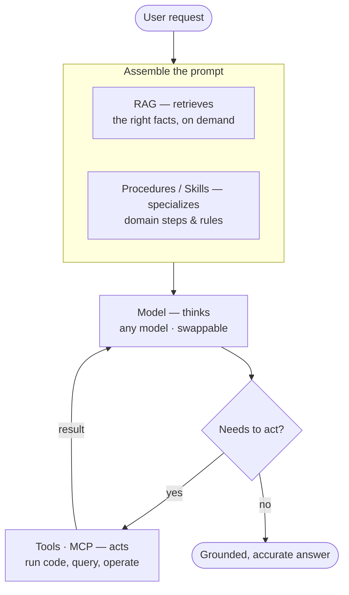

# LLM Harness Starter

[](https://github.com/nhatvu148/llm-harness-starter/actions/workflows/ci.yml)

> A clone-and-go scaffold for building a **grounded LLM agent** — the harness, not just the model.
> Wire up retrieval, tools, and procedures around any model, and (optionally) ship the whole thing as a **native binary**.

Most "LLM starter" repos are a thin wrapper around a chat API. The hard part isn't calling the model — it's the **harness** around it: giving a small, cheap model the right knowledge, the right tools, and the right procedure so it behaves like an expert. This scaffold gives you that harness with clean, swappable seams.

---

## The idea: it's the harness, not the model

The insight this scaffold is built on:

> **A frontier model with a thin setup and a modest model with a strong harness often land in the same place.**

Which means you can take a cheaper, smaller model and — with good retrieval, solid tool execution, and well-written procedures — get it to punch well above its weight. That's engineering, not a downgrade, and it's where most of the real value lives.

### The four seams

Four swappable pieces compose into a grounded answer. RAG and procedures assemble the prompt; the model reasons and calls tools in a **loop** until it's done (exactly what `run_turn()` in `src/api.py` does):



_Model thinks · Tools act · RAG retrieves · Procedures specialize — complementary seams, not competitors._

| Layer | Role | What it does |
|---|---|---|
| **Model** | *thinks* | The reasoning engine. Swappable — OpenAI today, anything tomorrow. |
| **Tools** (MCP-compatible) | *acts* | Lets the model actually DO things: run code, hit an API, operate a system. Reading a doc changes nothing — executing an action does. Tool defs use the standard JSON-schema shape, so they can be served over MCP later. |
| **Retrieval (RAG)** | *retrieves* | Semantic search feeds the model the RIGHT reference knowledge at the right moment, instead of stuffing everything into the prompt. |
| **Procedures ("skills")** | *specializes* | Curated how-to text: the steps, rules, and gotchas of your specific domain, injected when relevant. |

**These are complementary layers, not competitors.** Tools are how the agent *acts*; retrieval is how it gets the right *facts*; procedures are how it follows a *specialized workflow*. You don't pick one — you compose them.

---

## Quickstart

```bash
git clone https://github.com/nhatvu148/llm-harness-starter.git
cd llm-harness-starter

# Python env (uv) + Task runner
brew install uv go-task/tap/go-task     # macOS; see docs for other OSes
uv sync

# Configure
cp .env.example .env                     # add your OPENAI_API_KEY

# One-time: embed the example docs into the vector store
task index                               # embeds the docs via OpenAI (uses your key)

# Run the harness server, then chat with it (two terminals)
task run:api                             # starts the FastAPI server
task run:client                          # interactive client
```

Try **"Which country has won the most World Cup titles?"** or **"Who won the 2014 World Cup?"** (answered from the retrieved docs) and **"What is 88,966 × 0.92?"** (answered via the `calculate` tool) — the first two ground the model in the docs, the last delegates exact math it would otherwise fumble.

---

## The four swappable seams

Each layer sits behind a thin interface with **one working default**. Swap a default without touching the rest.

| Seam | Default | Swap to |
|---|---|---|
| **Provider** (`src/providers/`) | OpenAI (`gpt-4o-mini`) | Anthropic, a local model, … |
| **Retrieval** (`src/retrieval/`) | Chroma (local, persistent) | Qdrant, pgvector, … |
| **Tools** (`src/tools/`) | one example tool (`calculate`) | your own tools |
| **Procedures** (`src/procedures/`) | example markdown policies | your domain's how-to |

---

## Extend it in 3 steps

**Add reference docs (RAG):** drop `.md` / `.txt` files into `examples/docs/`, run `task index`. They're now retrievable.

**Add a tool:** write a function in `src/tools/registry.py` and decorate it with `@tool(...)`. The model can now call it.

**Add a procedure:** write a markdown file in `src/procedures/` describing the steps/rules for a task. It's injected into the prompt.

**Swap the model:** change `default_provider()` in `src/providers/__init__.py` (or set `MODEL` in `.env`). Everything else is untouched.

---

## Optional: ship it as a native binary

This scaffold can embed the Python harness **inside a C++ executable** using the Python/C API — useful when you want to distribute a single native binary without shipping source files.

```bash
task up          # clean, build with CMake, run the embedded binary
```

`task run:tools` bundles all four seam packages into the binary, and `task up` builds and runs it — verified on macOS, where it boots the full harness and serves requests. Two honest caveats: it still loads third-party deps from `.venv` at runtime via `PYTHONPATH`, so it is **not** a fully standalone binary; and only macOS ARM64 is tested — the Windows/Linux paths exist but are unverified. The native layer is entirely optional: the harness runs fine as a plain Python server (`task run:api`) if you don't need it.

---

## Project structure

```
.
├── src/
│   ├── providers/      # model provider interface + OpenAI default   [the model]
│   ├── retrieval/      # chunk + embed + semantic search (Chroma)    [RAG]
│   ├── tools/          # tool registry + example tool                [acts]
│   ├── procedures/     # curated how-to markdown, injected on demand [specializes]
│   ├── index.py        # `task index` — embed examples/docs
│   ├── api.py          # FastAPI server — composes the four layers
│   ├── client.py       # interactive test client
│   └── main.cpp        # optional: embed the server in a native binary
├── examples/
│   └── docs/           # FIFA World Cup facts the demo answers over
├── tools/              # build helpers for the native-binary path
├── Taskfile.yml
└── pyproject.toml
```

---

## Status

**v0.1.** The four-seam harness is wired end to end: provider (OpenAI), retrieval (Chroma), tools (with an example `calculate` tool), and procedures, all composed in `src/api.py`, plus an example doc set. The optional native-binary path bundles and runs the full harness on macOS.

### Roadmap
- [x] Provider interface + OpenAI default
- [x] Retrieval layer (Chroma) + `task index`
- [x] Tool registry + example tool
- [x] Procedures loader + example procedures
- [x] Generic example doc set (`examples/docs/`)
- [x] "Extend in 3 steps" docs
- [x] Native (C++) build bundles & runs the full harness (macOS; Python version auto-pinned to the venv)
- [ ] Anthropic provider example (second seam implementation)
- [ ] Verify/port the native build to Windows & Linux
- [ ] CI + a couple of tests

---

## Taskfile commands

- `task index` — embed the example docs into the vector store (run once)
- `task run:api` — run the harness server
- `task run:client` — interactive client
- `task check-py` — lint + format (Ruff)
- `task up` — build & run the native binary (optional native path)
- `task clean:build` / `task clean:venv` — cleanup

---

## License

MIT — see [LICENSE](LICENSE). Use it, fork it, build on it.
